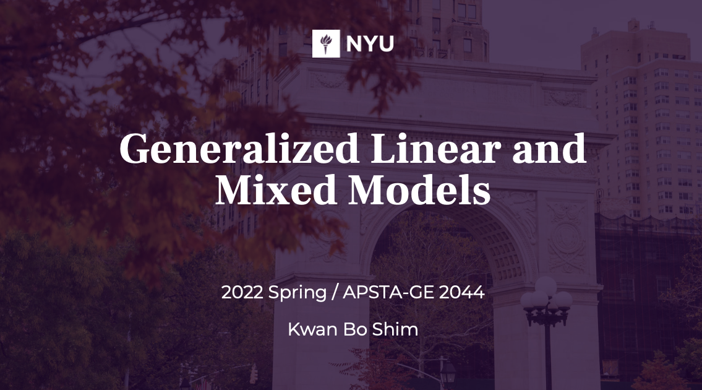

# Generalized Linear and Mixed Models course (2022 Spring)
course sub-material for Generalized Linear Mixture Model

  - Week 1 - [ codes & slides ](https://github.com/JosephKBS/21fall_statcomp/tree/main/w1) | [ R Shiny app ](https://apsta.shinyapps.io/StatCompWeek1/)

  - Week 2 - [ codes & slides ](https://github.com/JosephKBS/21fall_statcomp/tree/main/w2) | [ R Shiny app ](https://apsta.shinyapps.io/StatCompWeek2/)

  - Week 3 - [ codes & slides ](https://github.com/JosephKBS/21fall_statcomp/tree/main/w3) | [ R Shiny app ](https://apsta.shinyapps.io/StatCompWeek3/)| [ Quiz ](https://forms.gle/bNKpYkFf5ftfphqs5) | [ Solution ](https://github.com/JosephKBS/22SP_GLM/tree/main/W3/quiz1_sol.R)

  - Week 4 - [ codes & slides ](https://github.com/JosephKBS/21fall_statcomp/tree/main/w4) | [ R Shiny app ](https://apsta.shinyapps.io/StatCompWeek4/)| [ Quiz ](https://forms.gle/y3B53pcpfG4uX4Mg8) | [ Solution ](https://github.com/JosephKBS/22SP_GLM/tree/main/W4/quiz2_sol.R)

  - Week 5 - [ codes & slides ](https://github.com/JosephKBS/21fall_statcomp/tree/main/w5) | [ R Shiny app ](https://apsta.shinyapps.io/StatCompWeek5/) | [ Quiz ](https://forms.gle/bptzK9guRveGGmzU9)| [ Solution ](https://github.com/JosephKBS/22SP_GLM/tree/main/W4/quiz3_sol.R)

  - Week 6 - [ codes & slides ](https://github.com/JosephKBS/21fall_statcomp/tree/main/w6) | [ R Shiny app ](https://apsta.shinyapps.io/StatCompWeek6/) | [ Quiz ]( )| [ Solution ](https://github.com/JosephKBS/22SP_GLM/tree/main/W4/quiz4_sol.R)

  - Week 7 - [ codes & slides ](https://github.com/JosephKBS/21fall_statcomp/tree/main/w7) | [ R Shiny app ](https://apsta.shinyapps.io/StatCompWeek7/) | [ Quiz ]( )

